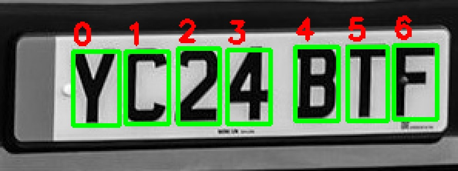
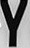

# Foundations of Artificial Intelligence

## Project overview

## folder structure

```
.
├── data
│   ├── Annotations
│   ├── inference
│   │   ├── raw
│   │   └── sessions
│   ├── OCR_training_data
│   │   ├── CNN_LETTER_DATASET
│   │   └── data
│   │       ├── test
│   │       ├── train
│   │       └── val
│   └── plate_detector_training_data
│       ├── train
│       │   ├── images
│       │   └── labels
│       └── validate
│           ├── images
│           └── labels
├── magicfolder
│   └── 11
│       └── characters
├── models
│   ├── CNN
│   │   ├── v1
│   │   ├── v2
│   │   ├── v3
│   │   └── v4
│   └── plate_detector
│       └── weights
├── Notes
│   ├── different_thresholds
│   ├── MORPHOLOGY
│   ├── Other
│   └── thresholding_with_otsu
├── src
│   ├── preprocessing
│   ├── training
│   └── utils
├── tests
│   └── temp
└── ui
```
+ data is for storing pictures before and after processing
+ models is for storing the model data
    + Plate detector
    + CNN OCR v1-v4
+ Notes: notes
+ src: python scripts for everything
+ ui: interface stuff
+ tests: testing scripts

+ data storing notation: what happens when an image is processed
    + new session is created with the next available id
    + looks like this
```
data/inference/sessions/6
├── characters
│   ├── 1.jpg
│   ├── 2.jpg
│   ├── 3.jpg
│   ├── 4.jpg
│   ├── 5.jpg
│   ├── 6.jpg
│   ├── 7.jpg
│   └── 8.jpg
├── contours.jpg
├── cropped.jpg
├── for_plate_detection.jpg
├── rawinput.jpg
└── thresholded.jpg
```
#### raw input

#### contours

#### example crop



## Collaborators

+ Niko Lausto
+ Jussi Grönroos
+ Jesse Mahkonen
+ Iikka Harjamäki